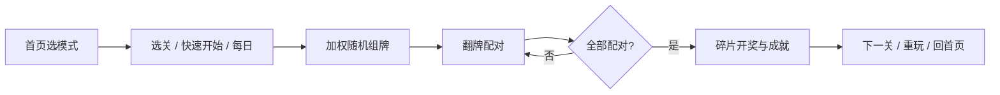

# 豆豆大挑战 — 项目设计文档

> 版本：当前主分支实现  
> 类型：H5 静态记忆配对小游戏（非商业、偏趣味向）  
> 技术栈：原生 HTML / CSS / JavaScript，无构建工具

---

## 1. 项目概述

### 1.0 编码与 HTML 约束

- 文本文件统一 **UTF-8**（见 `.editorconfig`、`.gitattributes`）
- AI/脚本修改约束见 `.cursor/rules/encoding-and-html.mdc`
- 提交或生成关卡后运行：`node scripts/validate-encoding.js`
- `index.html` 严重损坏时可运行：`node scripts/fix-index-html.js`

### 1.1 产品定位

**豆豆大挑战** 是一款面向移动端的表情包记忆翻牌配对游戏。玩家翻开两张牌，若图案相同则配对成功；在限时、限步或特殊惩罚规则下清空棋盘即过关。

### 1.2 设计目标

| 目标 | 说明 |
|------|------|
| 即开即玩 | 静态资源 + `levels-data.js`，支持 `file://` 离线双击打开 |
| 移动优先 | 单页双屏（首页 / 游戏页），棋盘按 `board-viewport` 自适应铺满 |
| 可重复游玩 | 每局按稀有度权重随机组牌，同图可出现多对 |
| 轻量进度 | `localStorage` 记录背包碎片、成就、每日挑战（不保存关卡通关记录） |
| 非联网依赖 | 无账号、无后端；分享使用 Web Share API / 剪贴板 |

### 1.3 核心玩法循环



---

## 2. 系统架构

### 2.1 总体架构

```
┌─────────────────────────────────────────────────────────┐
│                     index.html                          │
│  ┌──────────────┐  ┌──────────────┐  ┌──────────────┐ │
│  │  home-page   │  │  game-page   │  │  overlays    │ │
│  │  首页+菜单   │  │  顶栏+棋盘   │  │  选关/结算   │ │
│  └──────┬───────┘  └──────┬───────┘  └──────────────┘ │
└─────────┼─────────────────┼───────────────────────────┘
          │                 │
          ▼                 ▼
┌─────────────────────────────────────────────────────────┐
│                    game.js（主控）                       │
│  状态机 · 翻牌逻辑 · 布局 fitBoardGrid · UI 切换          │
└─────────┬───────────────────────────────────────────────┘
          │
    ┌─────┴─────┬─────────┬──────────┬──────────┬─────────┐
    ▼           ▼         ▼          ▼          ▼         ▼
 modes.js  difficulty  rarity.js  progress  daily.js  achievements
           .js                      .js                 .js
    │           │         │          │          │         │
    └───────────┴─────────┴──────────┴──────────┴─────────┘
                              │
                    levels.json / levels-data.js
                    assets/tiles/*.png
                    assets/sounds/*
```

### 2.2 模块职责

| 模块 | 文件 | 职责 |
|------|------|------|
| 主控制器 | `js/game.js` | DOM、对局流程、棋盘布局、模式/关卡切换 |
| 游戏模式 | `js/modes.js` | 普通 / 困难 / 挑战 规则标志与提示次数 |
| 难度公式 | `js/difficulty.js` | 按对数计算限时、限步、难度标签 |
| 稀有度 | `js/rarity.js` | A/R/SR/SSR 分配与加权抽牌 |
| 进度 | `js/progress.js` | 每日挑战、背包元数据（不记关卡通关） |
| 背包 | `js/backpack.js` | A/S/SS 碎片掉落、收集与合成 |
| 每日挑战 | `js/daily.js` | 困难第3关、全员同题、完成得 SSS、每日一次 |
| 成就 | `js/achievements.js` | 本地成就解锁与过关检测 |
| 教程 | `js/tutorial.js` | 首局（≤4 对）分步引导 |
| 音效 | `js/audio.js` | Kenney CC0 音效池与开关 |
| 样式 | `css/style.css` | 响应式、3D 翻牌、弹层、图鉴稀有度色 |
| 关卡数据 | `levels.json` + `js/levels-data.js` | 图池、关卡表、分模式关卡 |
| 构建脚本 | `scripts/generate-manifest.js` | 扫描图池并生成 JSON / 嵌入 JS |

### 2.3 脚本加载顺序

```html
difficulty.js → rarity.js → modes.js → progress.js → backpack.js → daily.js
→ achievements.js → tutorial.js → levels-data.js → audio.js → game.js
```

`game.js` 依赖前述全局对象（`GameModes`、`TileRarity`、`Progress` 等），必须在 `levels-data.js` 之后执行。

---

## 3. 界面与页面结构

### 3.1 页面划分

| 页面 | DOM | 可见时机 |
|------|-----|----------|
| 首页 | `#home-page` | 启动、过关回首页、游戏中点「首页」 |
| 游戏页 | `#game-page` | 开局后 |
| 选关弹层 | `#level-picker` | 首页「选关」或游戏中「选关」 |
| 结算弹层 | `#overlay` | 过关 / 失败 |

首页内嵌完整菜单（非侧边栏/非独立菜单弹框）：模式列表、今日挑战、快速开始、选关、成就、背包。

### 3.2 游戏页布局

```
game-page
├── game-header（关卡名、步数、时间、连击、提示、音效、选关、首页）
└── board-viewport（flex:1，占满剩余高度）
    └── board-scaler（padding:5px，flex 居中）
        └── #board（CSS Grid，动态 --card-size）
```

棋盘尺寸由 `fitBoardGrid()` 根据 `board-viewport` 宽高枚举最优行列，使单格尽量大且整盘完整显示（上限参考 148px，下限 52px）。

### 3.3 关键交互

- **快速开始**：当前模式 + 当前关卡索引直接开局  
- **选关**：底部抽屉列表，展示关卡名称与难度参数  
- **提示**：高亮一对中 **2 张** 未翻开牌（`hint-flash`），消耗次数因模式而异  
- **分享**：过关后 `navigator.share` 或复制文案  

---

## 4. 游戏规则设计

### 4.1 基础配对规则

1. 点击未翻开、未消除的牌 → 翻牌（3D `rotateY`）  
2. 连续翻开两张：  
   - **相同** `pairId` → 配对成功，连击 +1，普通/困难模式可播放渐隐动画  
   - **不同** → 短暂展示后盖回，连击清零  
3. 全部对子消除 → 胜利  

### 4.2 游戏模式

| 模式 ID | 名称 | 限时 | 限步 | 特殊机制 | 提示次数 |
|---------|------|------|------|----------|----------|
| `normal` | 普通 | ✓ | ✗ | — | 3 |
| `hard` | 困难 | ✓ | ✓ | — | 1 |
| `challenge` | 挑战 | ✗ | ✗ | 已配对牌 idle 惩罚（8~12s/关） | 0 |

**挑战模式 idle 惩罚**：随机选中一对已匹配牌开始倒计时；超时则盖回该对并重新随机目标对。惩罚秒数随关卡递减（第 5 关 8 秒）。

### 4.3 关卡与对数

- 单关最多 **20 对**（40 张牌，布局算法上限）  
- **普通 3 关 · 困难 4 关 · 挑战 5 关**，对数与限制随关卡递增  
- `levels.json`：`levels` 为普通模式；`modeLevels.hard` / `modeLevels.challenge` 为另两种模式  

| 模式 | 关卡数 | 对数 progression |
|------|--------|------------------|
| 普通 | 3 | 4 → 6 → 8 |
| 困难 | 4 | 6 → 8 → 10 → 12 |
| 挑战 | 5 | 8 → 10 → 12 → 14 → 16 |

关卡标签：入门 / 进阶 / 熟练 / 困难 / 专家（`difficultyLabel`）。

### 4.4 难度参数（`difficulty.js`）

**基准公式**（按当关对数）

- `timeLimit = round((24 + pairs × 14) × 0.97^stage)` 秒（**困难模式 ×0.5**，最低 30 秒）  
- `moveLimit = max(pairs+2, ceil(6 + pairs × 2.6) - stage)` 步（困难模式）  
- 挑战模式：`idleSeconds` 为 12 → 11 → 10 → 9 → 8（`stage` 0~4）  

### 4.5 通关结算碎片开奖（`backpack.js`）

过关后按模式掉落碎片，结算弹层内 **逐枚开奖**：

1. 先展示碎片等级（A / S / SS）大标签动画  
2. 再翻转展示对应表情包  
3. 已开出碎片缩略图排列在下方，继续下一枚  

开奖期间隐藏结算按钮，全部播完后显示操作区。

---

## 5. 卡牌与图池设计

### 5.1 组牌逻辑

每局开局：

1. 确定对数 `pairs`（关卡配置或每日随机档位）  
2. 调用 `TileRarity.pickWeighted(tilePool, pairs)` **有放回** 抽取 `pairs` 张图路径  
3. `buildDeck(images)`：每张图生成 2 张牌，相同 `pairId`，再洗牌  

因此同一表情包可在同一局出现 **多对**（例如 4 对中两次抽到同一张 SSR）。

**教程例外**：首局且 `pairs ≤ 4` 时使用 `pickWeightedUnique`，保证图不重复。

### 5.2 稀有度体系（`rarity.js`）

**图鉴固定稀有度**（`generate-manifest.js` 按文件名排序后的序号分位）

| 稀有度 | 约占比 | 图鉴标签 | 含义 |
|--------|--------|----------|------|
| A | 50% | 普通 | 前半序号 |
| R | 30% | 稀有 | |
| SR | 15% | 超稀有 | |
| SSR | 5% | 传说 | 末尾序号 |

**对局出现权重**（加权随机，可重复）

| 稀有度 | 权重 |
|--------|------|
| A | 50 |
| R | 30 |
| SR | 15 |
| SSR | 5 |

**背包 UI**：顶部固定 **SSS 专属卡**（`assets/tiles/25.png`），提供「合成」「抽奖」；下方为各卡 A/S/SS 碎片槽。未收集时灰显。局内抽牌仍用 `A/R/SR/SSR` 出现权重（与碎片等级独立）。

### 5.3 图池数据结构

```json
{
  "tiles": [
    { "src": "assets/tiles/1.png", "rarity": "A" },
    { "src": "assets/tiles/40.png", "rarity": "SSR" }
  ],
  "levels": [
    {
      "id": 1,
      "name": "第 1 关",
      "pairs": 2,
      "difficulty": "easy",
      "difficultyLabel": "简单",
      "timeLimit": 52,
      "moveLimit": 12
    }
  ],
  "modeLevels": {
    "hard": [ /* ... */ ],
    "challenge": [ /* ... */ ]
  }
}
```

关卡条目 **不再** 固化 `images` 数组；开局动态抽牌。  
**同图多对**：允许重复表情包；**按图片配对**（相同 `src` 即成功）。同模式第 1 关重复最多（约 35% 种类数），末关接近全不同；顶栏显示「N 种图」。

---

## 6. 每日挑战

- **难度固定**：困难模式 **第 3 关**（10 对 · 限时 77s · 限步 30）  
- **种子**：`dateKey` → 全员同日相同牌面与顺序  
- **奖励**：完成获得 **SSS 专属卡 ×1**（不发碎片掉落）  
- **次数**：每日仅可 **完成一次**，完成后当日不可再开  
- **记录**：`Progress.recordDaily` + 连续打卡 `dailyStreak`  

---

## 7. 进度与持久化

### 7.1 存储键

| 键 | 内容 |
|----|------|
| `doudou-dachallenge-progress` | 各模式通关、`_meta`（背包、教程、每日连续） |
| `doudou-achievements` | 成就解锁时间戳 |
| `doudou-sfx-enabled` | 音效开关 |

### 7.2 进度结构（示意）

```javascript
{
  "normal": {
    "1": { "bestMoves": 4, "moves": 4, "timeLeft": 30, "completedAt": 1710000000000 }
  },
  "hard": { /* ... */ },
  "daily": {
    "2026-05-19": { "bestMoves": 20, /* ... */ }
  },
  "_meta": {
    "backpack": {
      "assets/tiles/1.png": { "A": 2, "S": 1, "SS": 0 }
    },
    "tutorialDone": true,
    "dailyStreak": 3,
    "lastDailyDate": "2026-05-19"
  }
}
```

### 7.3 背包

- 每张表情包可收集 **A / S / SS** 三档碎片，数量累加在 `_meta.backpack[src]`  
- **通关掉落**：普通 2 枚、困难 4 枚、挑战 8 枚；每日挑战 2 枚  
- **碎片等级概率**（按当前关卡 stage 抽取，与局内 A/R/SR/SSR 独立）：

| 模式 | A | S | SS | 随关卡变化 |
|------|---|---|-----|------------|
| 普通 / 每日 | 90% | 10% | 0% | 固定 |
| 困难 | 余量 | 9% | 1%→4% | 每关 SS +1%（第 1 关 1%，第 4 关 4%） |
| 挑战 | 余量 | 16% | 4%→8% | 每关 SS +1%（第 1 关 4%，第 5 关 8%） |

困难/挑战的 A = 100% − S − SS（当前关）。  
- 旧版 `gallery` 数组首次加载会迁移为每张 1 枚 A 碎片  
- 成就：`gallery_half` / `gallery_all` 改为按「至少 1 碎片」统计收集进度  
- **碎片数量无上限**，A/S/SS 累计存储；背包每张卡固定展示三档碎片槽与数量角标  
- **SSS 专属卡**：固定 `assets/tiles/25.png`，不占碎片掉落池，背包置顶展示  
- **合成**：选卡消耗 **4A + 2S + 1SS** → **SSS 卡 ×1**（计入 `synthesized['assets/tiles/25.png']`）  
- **抽奖**：消耗 **SSS卡 ×1**；**谢谢惠顾 20%**，其余 10 种（5 正向 + 5 约定）各 **8%**，见 [`docs/LOTTERY-REWARDS.md`](docs/LOTTERY-REWARDS.md) · **我的抽奖记录**可标记兑现  
- 旧版 `15.png` 及按卡分散的 `synthesized` 会自动合并到 25.png；**SS 碎片为绿色**边框/标签

---

## 8. 成就系统

| ID | 标题 | 触发条件 |
|----|------|----------|
| first_win | 初试身手 | 首次通关 |
| combo_5 / combo_10 | 连击新手/大师 | 单局连击 ≥5 / ≥10 |
| daily_done | 每日打卡 | 完成今日挑战 |
| gallery_half / gallery_all | 背包收藏家/背包满员 | 卡片过半 / 每张至少 1 碎片 |
| first_synth / synth_10 | 初次合成 / 合成达人 | 首次合成 / 累计合成 10 次 |
| expert_win | 专家认证 | 通关任意 16 对关卡 |
| challenge_clean | 压力清零 | 挑战模式通关且未被盖回 |
| no_hint_win | 自力更生 | 困难模式未用提示通关 |

过关时 `Achievements.checkAfterWin(ctx)` 批量检测，新解锁在结算弹层上方浮条展示。

---

## 9. 棋盘布局算法

### 9.1 `gridSizeForViewport(cardCount, maxW, maxH, gap)`

- 枚举列数 `cols` 从 2 到 `cardCount`  
- 对每种 `cols` 计算 `rows = ceil(cardCount / cols)`  
- 单格边长 `cell = min(maxW, maxH 约束下的 (宽/列, 高/行))`  
- 选取 **单格最大** 的布局（同尺寸时优先行数更少）  

### 9.2 `fitBoardGrid(cardCount)`

- 测量 `#board-viewport` 尺寸，减去 `board-scaler` 内边距（5px×2）  
- 设置 CSS 变量 `--card-size`、`--board-gap`  
- `ResizeObserver` 监听视口变化自动重算  

---

## 10. 表现与动画

| 效果 | 实现 |
|------|------|
| 翻牌 | `.card-inner` `rotateY(180deg)` |
| 配对渐隐 | `.card.crushing` 仅 opacity 动画（无旋转缩放） |
| 连击 | HUD + 顶部 toast + 可选 `navigator.vibrate` |
| 提示 | `.hint-flash` 外发光 + 牌背 inset 描边，`z-index:30` |
| 挑战倒计时 | 配对牌边框变色 + 进度条 `idle-risk` |

`prefers-reduced-motion` 下缩短动画时长。

---

## 11. 音频

- 资源：`assets/sounds/`（Kenney CC0）  
- API：`GameAudio.play(name)`、`toggle()`、`playMatchCombo(combo)`  
- 事件：翻牌、配对、失败、点击、过关等  

---

## 12. PWA 与运行环境

| 场景 | 关卡加载 | Manifest |
|------|----------|----------|
| `http(s)://` | `fetch('levels.json')` | 动态注入 `<link rel="manifest">` |
| `file://` | `window.LEVELS_DATA`（`levels-data.js`） | 不加载（避免 CORS） |

`manifest.json`：`standalone`、竖屏、主题色 `#16213e`。

---

## 13. 资源管线（开发工具）

| 脚本 | 用途 |
|------|------|
| `scripts/generate-manifest.js` | 扫描 `assets/tiles/`，写 `levels.json` + `levels-data.js` |
| `scripts/slice-spritesheet.py` | 雪碧图切分为单张 tile |
| `scripts/optimize-tiles.py` | 压缩 PNG（建议边长约 148px） |

**推荐工作流**

```bash
# 1. 准备图池 assets/tiles/*.png
# 2. 可选压缩
python scripts/optimize-tiles.py
# 3. 生成关卡
node scripts/generate-manifest.js
# 4. 本地预览
python -m http.server 3456
# 浏览器打开 http://localhost:3456
```

---

## 14. 目录结构

```
customGame/
├── index.html              # 入口
├── manifest.json           # PWA
├── levels.json             # 关卡清单（HTTP 加载）
├── DESIGN.md               # 本文档
├── css/
│   └── style.css
├── js/
│   ├── game.js             # 主逻辑
│   ├── modes.js
│   ├── difficulty.js
│   ├── rarity.js
│   ├── progress.js
│   ├── daily.js
│   ├── achievements.js
│   ├── tutorial.js
│   ├── audio.js
│   └── levels-data.js      # 自动生成，离线用
├── assets/
│   ├── tiles/              # 表情包 PNG
│   └── sounds/             # 音效
└── scripts/
    ├── generate-manifest.js
    ├── slice-spritesheet.py
    └── optimize-tiles.py
```

---

## 15. 扩展与约束

### 15.1 已知约束

- 无服务端：排行榜、云存档需自行扩展  
- 单线程 UI：长列表选关依赖原生滚动  
- 图池变更后需重新运行 `generate-manifest.js`  

### 15.2 可扩展点

| 方向 | 建议 |
|------|------|
| 新模式 | 在 `modes.js` 增加标志，于 `game.js` 分支 |
| 调稀有度 | 修改 `rarity.js` 的 `PICK_WEIGHT` / `assignRarityByIndex` |
| 调难度曲线 | 修改 `difficulty.js` 公式后重新 generate |
| 新成就 | 在 `achievements.js` 的 `DEFS` 与 `checkAfterWin` 增加条件 |
| 新皮肤 | 替换 `css/style.css` 变量与 tile 资源 |

### 15.3 非目标（当前版本）

- 内购、广告、账号系统  
- 实时多人对战  
- 关卡编辑器（关卡由脚本生成）  

---

## 16. 术语表

| 术语 | 含义 |
|------|------|
| 对 / pair | 两张相同图案组成的匹配单位 |
| 图池 / tilePool | 全部可用表情包及稀有度元数据 |
| pairId | 同一对两张牌的逻辑 ID（0..pairs-1） |
| 有放回抽取 | 每次抽牌独立，同一 src 可被抽中多次 |
| 模式 | normal / hard / challenge 规则集合 |

---

*文档随代码演进更新；以 `js/` 与 `index.html` 实际实现为准。*
